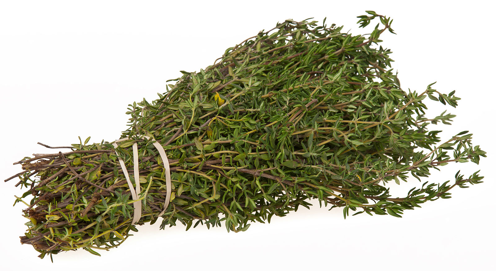

# Herbmates




HerbMates is an inventory app of all the *currently* available fresh herbs available in your apt building, as well as place to donate herbs that you won't be able to use in time. An automatic expiration date of 5 days is added to all herbs donated and will drop and only active herbs are listed. 
  - Herbs are filtered by status and apt complex. You can only see fresh herbs available in your building! 
  - An SMS is sent for each request and every confirmation during the flow of the agreed drop-off. 
  - Text area is available for additional pickup instructions i.e. meet me in the lobby, at apt 4, et cet
  - Cancellations are also available in case you're unable to pickup/dropoff an herb bundle. 
  - Herbs that require your immediate attention are highlighted and placed to front of the queue upon sign-on. 


### Techstack:
* Python 3 
* jQuery/AJAX
* vanilla JS
* Bootstrap4
* Flask + Jinja 
* Twilio for SMS
* SQLalchemy
* Postgresql
* Sweetalert2.js: [https://sweetalert2.github.io/]


### Installation
Install these dependencies and devDependencies and start the server.

```sh
$ cd herbmates_flask
$ virtualenv env
$ source env/bin/activate 
$ pip3 install -r requirements
$ python3 server.py
Type localhost:5000/ into your browser
```

