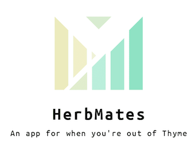

# Herbmates



## Checkout your building's current inventory


## Donate an herb yourself


HerbMates is an inventory app of all the *currently* available fresh herbs in your apt building, as well as a place to list herbs that you won't be able to use in time. An expiration date of 5 days is automatically added to all donations and will drop from the UI and only active herbs will be displayed. 
  - Herbs are filtered by status and apt complex. You can only see fresh herbs listed less than 5 days ago and available only in your building! 
  - An SMS is sent for each request and every step of the interaction between the two parties handing off the herb bundle. 
  - A text area is available for additional pickup instructions i.e. meet me in the lobby, at apt 4, et cet.
  - Cancellations are also available in case you're unable to pickup/dropoff an herb bundle. A cancelled herb will get relisted but their expirations remain the same.
  - Herbs that require your immediate attention are highlighted and placed to front of the queue when you sign-on. 


### Techstack:
* Python 3 
* jQuery/AJAX
* vanilla JS
* Bootstrap4
* Flask + Jinja 
* Twilio for SMS
* SQLalchemy
* Postgresql
* Sweetalert2.js: [https://sweetalert2.github.io/]


### Installation
Install these dependencies and start the server. 

```sh
$ cd herbmates_flask
$ virtualenv env
$ source env/bin/activate 
$ pip3 install -r requirements
$ python3 server.py

Type localhost:5000/ into your browser
```

